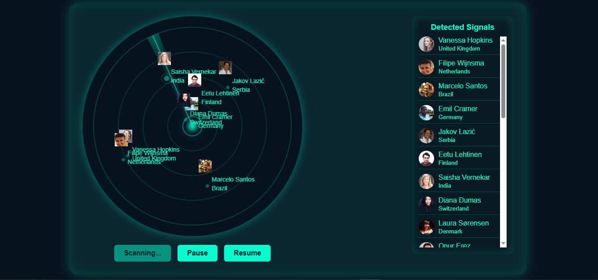
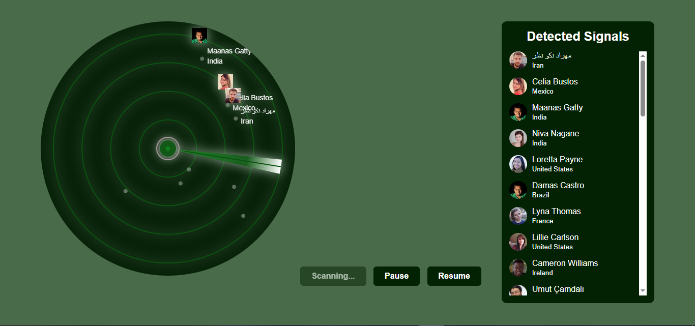

# Radar Signal Detector

This is radar signal detector it displays dots on a radar and when the scanning line pass over a dot it detects the signal i use the Random user API to show name and profile images the detected persons name and image show on radar and also  added on the detection list . The detector includes pause and resume button to control the sccaning process.

## Built with
- HTML
- CSS
- JavaScript

## Screenshot

## After changes Screenshot
